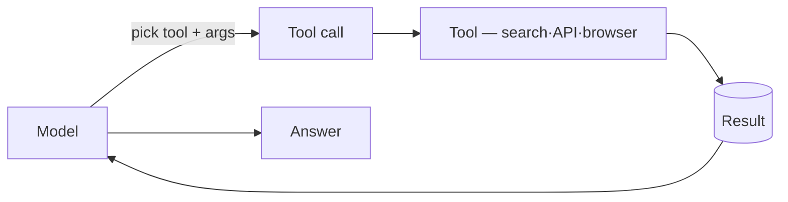

import Slide from 'stack-site-builder/components/Slide.astro';

<Slide class="cover">

# Tools

The functions that connect a model to the outside world

*awesome-ai-stack · concept slides*

</Slide>

<Slide>

## What it is

On its own a model **only generates text**.
Searching, reading a page, booking an appointment — all of it happens **only through tools**.

Picking a tool and filling in its arguments is what's commonly called **function calling**.

</Slide>

<Slide>

## Why it matters

A model's knowledge stops at training time, and it can't *act* on its own. Tools bridge both gaps.

| Without tools | What a tool fills in |
| --- | --- |
| **Stale knowledge** — nothing past the cutoff | Web search for fresh facts and prices |
| **Unreadable pages** | Scraping/crawling to pull the content |
| **Un-clickable UIs** | Browser automation to act like a person |
| **Out-of-reach apps** | App/API integration to delegate auth + calls |
| **Un-runnable code** | Code execution in a sandbox |

</Slide>

<Slide class="center">

## The kinds of tools

Split by what they connect to

</Slide>

<Slide>

## Web search · scraping

:::cols
### Web search
Returns web results as **ready-to-use excerpts and citations**

- facts and news past the cutoff
- fast-changing values like prices
- augmenting RAG's external sources

*tavily · exa*

---

### Scraping · crawling
Turns a page into a **model-readable format (markdown)**

- extract the body of a found page
- collect JS-rendered dynamic pages
- crawl a whole site to document it

*firecrawl*
:::

</Slide>

<Slide>

## Browser · integration · code

:::cols
### Browser automation
Clicks and types on API-less screens like a person

- flows that need login/session
- decide the next action from the screen

*browser-use · stagehand*

---

### App / API integration
Exposes mail·calendar·SaaS as tools behind one layer

- delegate OAuth
- a standardized bundle of tools

*composio*

---

### Code execution
Runs model-written code in an isolated environment

- exact math and data transforms
- verify the code actually runs

*e2b*
:::

</Slide>

<Slide>

## How tool calling works

- **Schema** — each tool's name, description, and input shape are given to the model, which decides which tool fits
- **Filling arguments** — the model picks a tool and produces the input as JSON; malformed calls are caught by validation and retried
- **Feeding results back** — the result goes back into reasoning to decide the next step; tools can be chained

Passing tool specs over a standard protocol is taking hold too — **MCP** (Model Context Protocol) is one such standard.

</Slide>

<Slide class="center">

## Principles to keep in mind

**Start with few tools** · fewer ways to pick wrong

**The schema is the manual** · ambiguity breeds misuse

**Don't trust output — verify it** · tool output is a check target too

**Isolate side effects** · run write/execute tools in a code sandbox

</Slide>
