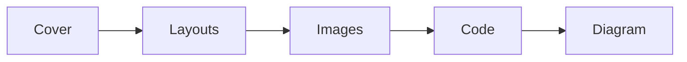
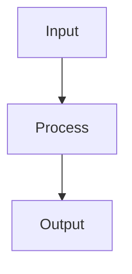
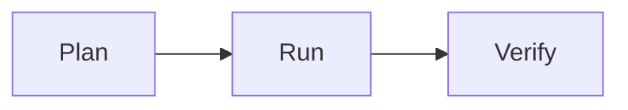

import { Image } from 'astro:assets';
import Slide from '../../../../components/Slide.astro';

{/*
  Two ways to add images:
  1) assets — `@assets/...` (= src/assets). Best when several language decks
     share the same image (one copy).
  2) co-located — put the image next to this mdx and import it with `./file`.
     Best when each language uses a different image (this folder is this deck,
     this language). So this deck is a folder: index.mdx + images beside it.
*/}
import coverBg from '@assets/slides/sample-layouts/course-bg.png'; // ① assets (shared across languages)
import media from './course-bg-2.png'; // ② co-located (this deck only)

<Slide class="cover" bg={coverBg}>

# Layout sample

Every slide layout and element in one deck

*awesome-ai-stack · demo*

</Slide>

<Slide source="Source: awesome-ai-stack docs · example.com/docs">

## Default layout
::sub[A small subtitle under the title — added with `::sub[text]`]

`<Slide>` — with no class, the title is **pinned to the top** (the default slide).

- unordered list
- inline: **bold**, *italic*, `code`, [link](https://example.com)

1. ordered list
2. second item

> Blockquotes render like this.

</Slide>

<Slide class="center">

## Center layout

`<Slide class="center">` — content is centered vertically and horizontally.

Good for a short emphasis slide or a section divider.

</Slide>

<Slide>

## Column layout

`:::cols` … `---` … `:::` — split into columns in pure Markdown.

:::cols
### Left column
- item A
- item B

*(`###` inside a column is a content sub-heading — only each slide's title goes in the TOC)*

---

### Right column
- item C
- item D
:::

</Slide>

<Slide>

## Table

| Layout | Syntax | Note |
| --- | --- | --- |
| cover | `class="cover"` | large centered title |
| background image | `bg={img}` | full-bleed |
| columns | `:::cols` | split with `---` |
| media split | `aas-split` | image · code · diagram |
| align/fill | `img-top`·`fill` | vertical position · cover |
| subtitle | `::sub[…]` | small, under the title |
| source | `source="…"` | bottom-right, ≤2 lines |
| TOC-excluded | `toc={false}` | heading hidden |

Tables use standard Markdown syntax. Hover a diagram or image for an **Enlarge** button (top-right).

</Slide>

<Slide class="center">

## Code

Code slides — basic · left/right split · stacked

</Slide>

<Slide>

### Code basic

Code blocks get the same Shiki highlighting as the rest of the site.

```ts
async function goToSlide(deck: HTMLElement, i: number) {
  const target = deck.querySelectorAll('.aas-slide')[i];
  deck.scrollLeft = target.offsetLeft; // jump to the snap point
  return i;
}
```

</Slide>

<Slide>

### Code left, text right

<div class="aas-split">

```ts
function go(deck, i) {
  const s = deck
    .querySelectorAll('.aas-slide');
  deck.scrollLeft = s[i].offsetLeft;
}
```

<div>

Put the code block first and the text after inside `aas-split` to get code on the left.

- same split syntax as images
- long lines scroll inside the code

</div>
</div>

</Slide>

<Slide>

### Text left, code right

<div class="aas-split">
<div>

Just swap the order — text first, code block after, and the code is on the right.

- tune the ratio with `r-30-70` / `r-70-30`

</div>

```ts
function go(deck, i) {
  const s = deck
    .querySelectorAll('.aas-slide');
  deck.scrollLeft = s[i].offsetLeft;
}
```

</div>

</Slide>

<Slide>

### Code on top, text below

```ts
deck.scrollLeft = slide.offsetLeft; // jump to the snap point
```

Put the code block first and the caption underneath — no split needed, it just stacks.

</Slide>

<Slide class="center">

## Images

Image slides — placement · ratios · alignment · fill

</Slide>

<Slide source="Image: awesome-ai-stack sample asset">

### Image on top, text below

<Image src={media} alt="AI course background" class="aas-media-top" />

A large image on top with a short caption underneath. Hover the image for an Enlarge button.

</Slide>

<Slide>

### Image left, text right (50:50)

<div class="aas-split">
<Image src={media} alt="AI course background" />
<div>

Put the `<Image>` first and the text after inside `<div class="aas-split">` to get the image on the left.

- image and text split evenly
- good for a quick point

</div>
</div>

</Slide>

<Slide>

### Image left, text right (30:70)

<div class="aas-split r-30-70">
<Image src={media} alt="AI course background" />
<div>

The `r-30-70` modifier makes the image narrow (30%) and the text wide (70%).

Good when the copy is long or the image is just supporting.

</div>
</div>

</Slide>

<Slide>

### Text left, image right (50:50)

<div class="aas-split">
<div>

Just swap the order — text first, `<Image>` after, and the image is on the right.

- evenly split

</div>
<Image src={media} alt="AI course background" />
</div>

</Slide>

<Slide>

### Text left, image right (70:30)

<div class="aas-split r-70-30">
<div>

`r-70-30` makes the text wide (70%) and the image narrow (30%).

</div>
<Image src={media} alt="AI course background" />
</div>

</Slide>

<Slide>

### Image vertical alignment
::sub[Where the image sits in a vertically-filled (`tall`) slide — `img-top` · `img-center` · `img-bottom`]

Against a slide filled vertically, the image can sit at the top, center, or bottom. The next three slides show each.

</Slide>

<Slide>

#### Top (img-top)

<div class="aas-split tall r-30-70 img-top">
<Image src={media} alt="AI course background" />
<div>

`img-top` — in a vertically-filled slide the image sits at the **top**.

</div>
</div>

</Slide>

<Slide>

#### Center (img-center)

<div class="aas-split tall r-30-70 img-center">
<Image src={media} alt="AI course background" />
<div>

`img-center` — the image is **vertically centered** (the default).

</div>
</div>

</Slide>

<Slide>

#### Bottom (img-bottom)

<div class="aas-split tall r-30-70 img-bottom">
<Image src={media} alt="AI course background" />
<div>

`img-bottom` — in a vertically-filled slide the image sits at the **bottom**.

</div>
</div>

</Slide>

<Slide>

### Fill (cover)
::sub[`fill` — a tall image cropped to css `cover`]

<div class="aas-split fill">
<Image src={media} alt="AI course background" />
<div>

Add `fill` and the image fills the slide vertically; the overflow is cropped (`object-fit: cover`).

Works together with the ratio modifiers (`r-30-70`, etc.).

</div>
</div>

</Slide>

<Slide class="center">

## Diagrams

Diagram slides — basic · left/right split · stacked

</Slide>

<Slide>

### Diagram basic



Mermaid diagrams render in the current (light/dark) theme.

</Slide>

<Slide>

### Diagram left, text right

<div class="aas-split">



<div>

Just like images and code, put the diagram first inside `aas-split` to place it on the left.

- a vertical (`TB`) graph fits a narrow column well
- the diagram scales down to the column width

</div>
</div>

</Slide>

<Slide>

### Text left, diagram right

<div class="aas-split r-70-30">
<div>

Text first, diagram after, and the diagram is on the right.

Here `r-70-30` makes the text wide and the diagram narrow.

</div>


</div>

</Slide>

<Slide>

### Diagram on top, text below



Put the diagram first and the caption underneath — no split, it just stacks.

</Slide>

<Slide toc={false}>

## This heading is not in the TOC

This slide is wrapped in `<Slide toc={false}>`. Open the TOC (☰) and this heading **won't be listed** — the slide itself still pages through normally.

</Slide>

<Slide class="center">

## The end

Open `src/content/slides/en/sample-layouts/index.mdx` to see the syntax.

</Slide>
