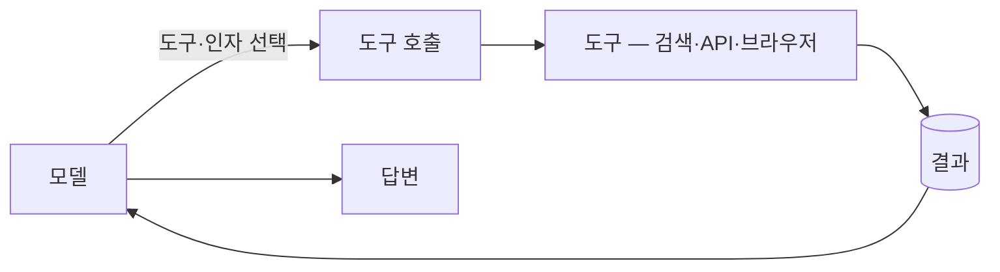

import Slide from '../../../components/Slide.astro';

<Slide class="cover">

# 도구

모델이 외부 세계와 상호작용하도록 연결하는 함수

*awesome-ai-stack · 개념 슬라이드*

</Slide>

<Slide>

## 무엇인가

모델 혼자서는 **텍스트를 생성할 뿐**입니다.
검색하거나 페이지를 읽거나 일정을 잡는 일은 모두 **도구를 통해서만** 일어납니다.

이 "도구를 고르고 인자를 채운다"가 흔히 말하는 **function calling**입니다.

</Slide>

<Slide>

## 왜 중요한가

모델의 지식은 학습 시점에 멈춰 있고, 스스로 무언가를 *실행*하지도 못합니다. 도구가 그 둘을 메웁니다.

| 도구가 없으면 | 도구로 메우는 것 |
| --- | --- |
| **낡은 지식** — 컷오프 이후를 모름 | 웹 검색으로 최신 사실·시세 조회 |
| **읽지 못하는 페이지** | 스크래핑·크롤링으로 본문 수집 |
| **클릭하지 못하는 UI** | 브라우저 자동화로 사람처럼 조작 |
| **닿지 못하는 앱** | 앱·API 통합으로 인증·호출 위임 |
| **돌려보지 못하는 코드** | 코드 실행으로 샌드박스에서 실행 |

</Slide>

<Slide class="center">

## 도구의 종류

무엇과 연결되느냐로 갈립니다

</Slide>

<Slide>

## 웹 검색 · 스크래핑

### 웹 검색
질문에 맞는 웹 결과를 **바로 쓸 수 있는 발췌·근거**로 돌려줌

- 컷오프 이후의 사실·뉴스
- 시세처럼 자주 바뀌는 값
- RAG의 외부 출처 보강

*tavily · exa*

### 스크래핑·크롤링
특정 페이지를 **모델이 읽을 형식(마크다운)**으로 변환

- 검색으로 찾은 페이지 본문 추출
- JS로 렌더되는 동적 페이지 수집
- 사이트 전체를 돌며 문서화

*firecrawl*

</Slide>

<Slide>

## 브라우저 · 통합 · 코드 실행

### 브라우저 자동화
API 없는 화면을 사람처럼 클릭·입력

- 로그인·세션이 필요한 흐름
- 화면을 보고 다음 동작 결정

*browser-use · stagehand*

### 앱·API 통합
메일·캘린더·SaaS를 한 겹 뒤에서 도구로 노출

- OAuth 인증을 위임
- 표준화된 도구 묶음

*composio*

### 코드 실행
모델이 짠 코드를 격리 환경에서 실행

- 정확한 계산·데이터 변환
- 코드 동작 검증

*e2b*

</Slide>

<Slide>

## 도구 호출은 어떻게 동작하나

- **스키마** — 각 도구의 이름·설명·입력 형식을 모델에 전달. 모델은 이 명세로 어떤 도구가 맞는지 판단
- **인자 채우기** — 도구를 고르고 입력 인자를 JSON으로 생성. 잘못된 형식은 검증으로 거르고 재시도
- **결과 반영** — 호출 결과를 추론에 넣어 다음 동작 결정. 여러 도구를 이어 부르기도

도구 명세를 표준 프로토콜로 주고받는 **MCP**(Model Context Protocol)도 자리 잡고 있습니다.

</Slide>

<Slide class="center">

## 기억할 원칙

**적은 도구로 시작한다** · 잘못 고를 여지를 줄인다

**스키마가 곧 설명서다** · 모호하면 오용이 는다

**결과를 믿지 말고 검증한다** · 도구 출력도 검사 대상

**부수효과는 격리한다** · 쓰기·실행은 코드 샌드박스에서

</Slide>
