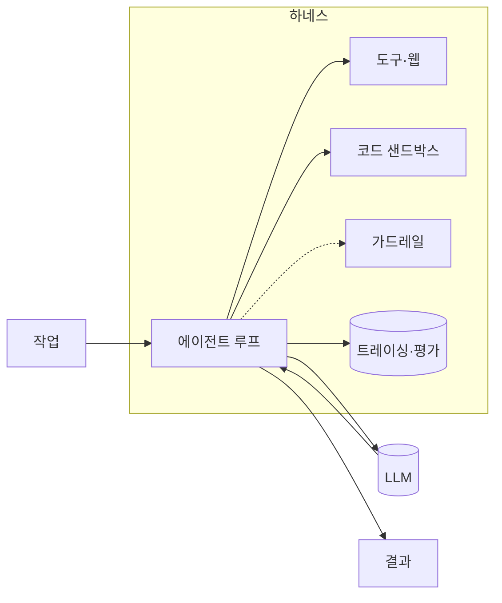
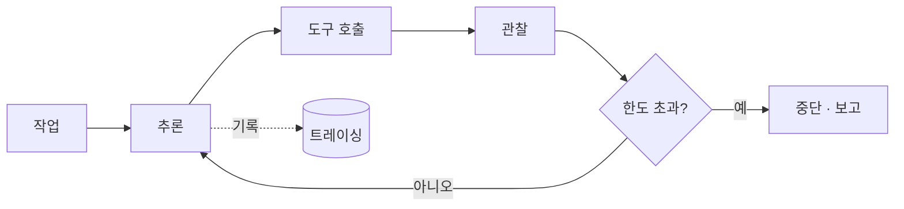

import Slide from 'stack-site-builder/components/Slide.astro';

<Slide class="cover">

# 하네스 엔지니어링

LLM을 스캐폴딩으로 감싸 프로덕션에서 안정적으로 동작하게 만드는 일

*awesome-ai-stack · 개념 슬라이드*

</Slide>

<Slide>

## 무엇인가

단일 LLM 호출은 똑똑하지만 그 자체로는 **불안정**합니다. 같은 프롬프트가 어제는 통과하고 오늘은 빗나갑니다.

모델은 **한 부품**일 뿐이고, 하네스는 그 모델을 믿을 수 있게 만드는 **나머지 전부**입니다.

</Slide>

<Slide>

## 프롬프트에서 하네스로

:::cols
### 프롬프트 엔지니어링
문장을 다듬기

영리한 프롬프트 → LLM → 출력

*더 영리한 문장을 찾는 일*

---

### 하네스 엔지니어링
둘레를 설계하기

작업 → 루프·도구·샌드박스·가드레일·평가 ↔ LLM → **신뢰할 수 있는 출력**

*모델이 틀릴 수 있다는 전제 위에서 설계*
:::

</Slide>

<Slide>

## 왜 중요한가

데모와 프로덕션 사이의 간극은 대부분 **모델이 아니라 하네스**입니다. 아래 문제들은 더 큰 모델로 잘 풀리지 않습니다 — 구조의 문제이기 때문입니다.

| 흔한 실패 | 하네스로 해결 |
| --- | --- |
| **멈추지 않는 루프** — 끝없는 재시도 | 제한된 에이전트 루프 |
| **위험한 부수효과** — 파일 삭제·임의 요청 | 코드 샌드박스 |
| **위험·주제 이탈 출력** | 가드레일 |
| **조용한 오답** — 그럴듯한 거짓 | 평가·트레이싱 |
| **"어제는 됐는데"** — 조용한 품질 저하 | 관측 |

</Slide>

<Slide>

## 능력 — 모델 · 도구

:::cols
### 모델 — 추론 엔진
비용·지연·성능 균형에 따라 **교체할 수 있게** 둔다

- 직접 호출: claude · openai · gemini
- 게이트웨이: litellm · openrouter

한 모델이 죽거나 느려질 때 다른 모델로 넘깁니다.

---

### 도구·웹 접근
에이전트가 *실제로* 할 수 있는 일을 정한다

- 앱 호출 · 검색 · 최신 데이터
- 브라우저 조작

지금의 실제 데이터는 **도구를 통해** 들어옵니다.
:::

</Slide>

<Slide>

## 안전장치 — 실패를 막는 층

:::cols
### 🧪 코드 샌드박스
모델이 짠 코드를 격리 실행 — `rm -rf ~`를 생성해도 샌드박스 안에서만

*e2b*

### 🛡 가드레일
입력·출력을 **런타임에** 검증 — 인젝션 차단, 개인정보 마스킹

*guardrails-ai · nemo-guardrails*

---

### 📊 평가
지표·테스트로 품질 채점 — 조용한 오답을 근거와 대조

*deepeval · ragas · opik*

### 🔭 관측
모든 단계·토큰·비용 트레이싱 — 회귀를 먼저 포착

*langfuse · langsmith · arize-phoenix*
:::

</Slide>

<Slide>

## 오케스트레이션 — 사이클을 돌리는 척추

루프는 **추론 → 행동 → 관찰**을 순서대로 호출하고, 게이트에서 멈출지·재시도할지·통과시킬지 정하며, 매 단계를 트레이싱에 남깁니다.

*langgraph · openai-agents-sdk · crewai · agno*

</Slide>

<Slide>

## 어떻게 접근하나

한꺼번에 다 만들지 않습니다. 위험이 나타나는 **순서대로** 한 겹씩.

1. **루프 + 모델**로 시작 — 가장 단순한 추론→행동 루프 하나
2. 코드를 돌리면 **샌드박스** — 부수효과를 격리
3. 출력이 사용자에게 닿으면 **가드레일** — 닿기 전에 검증
4. 반복을 시작하면 **평가 + 트레이싱** — 측정할 수 없는 건 개선할 수 없으니까요

</Slide>

<Slide class="center">

## 기억할 원칙

**작게 시작해 측정으로 키운다**

**의심스러우면 막는다** · 애매할 때 차단을 기본값으로

**모델은 갈아끼울 수 있게 둔다**

**루프에는 한도를 둔다**

</Slide>
