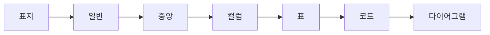

import Slide from '../../../components/Slide.astro';

<Slide class="cover">

# 레이아웃 샘플

모든 슬라이드 레이아웃과 요소를 한 덱에

*awesome-ai-stack · 데모*

</Slide>

<Slide>

## 일반 레이아웃

`<Slide>` — 클래스 없이 쓰면 제목이 **상단에 고정**되는 기본 슬라이드입니다.

- 순서 없는 목록
- 인라인: **굵게**, *기울임*, `코드`, [링크](https://example.com)

1. 순서 있는 목록
2. 두 번째 항목

> 인용문은 이렇게 표시됩니다.

</Slide>

<Slide class="center">

## 중앙 정렬 레이아웃

`<Slide class="center">` — 내용이 세로·가로 중앙에 옵니다.

짧은 강조 슬라이드나 섹션 구분에 좋습니다.

</Slide>

<Slide>

## 컬럼 레이아웃

`:::cols` … `---` … `:::` — 순수 마크다운으로 컬럼을 나눕니다.

:::cols
### 왼쪽 열
- 항목 A
- 항목 B

*(`###` 하위 제목은 `toc_level: 3`이면 목차에 들어갑니다)*

---

### 오른쪽 열
- 항목 C
- 항목 D
:::

</Slide>

<Slide>

## 표

| 레이아웃 | 문법 | 비고 |
| --- | --- | --- |
| 표지 | `class="cover"` | 큰 제목, 중앙 |
| 중앙 | `class="center"` | 세로 중앙 |
| 컬럼 | `:::cols` | `---`로 구분 |
| 목차 제외 | `toc={false}` | 제목 숨김 |

표는 표준 마크다운 문법을 그대로 씁니다.

</Slide>

<Slide>

## 코드

코드 블록은 사이트와 동일한 Shiki 하이라이팅이 적용됩니다.

```ts
async function goToSlide(deck: HTMLElement, i: number) {
  const target = deck.querySelectorAll('.aas-slide')[i];
  deck.scrollLeft = target.offsetLeft; // 스냅 지점으로 이동
  return i;
}
```

</Slide>

<Slide>

## 다이어그램



Mermaid 다이어그램은 테마(라이트/다크)에 맞춰 렌더됩니다.

</Slide>

<Slide toc={false}>

## 이 제목은 목차에 없습니다

이 슬라이드는 `<Slide toc={false}>`로 감쌌습니다. 우측 목차(☰)를 열어 보면 이 제목은 **나타나지 않습니다** — 슬라이드 자체는 그대로 넘겨집니다.

</Slide>

<Slide class="center">

## 끝

문법이 궁금하면 `src/content/slides/ko/sample-layouts.mdx` 를 열어 보세요.

</Slide>
