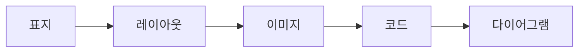
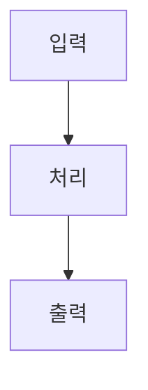
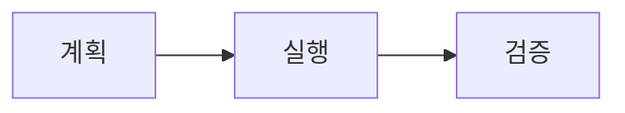

import { Image } from 'astro:assets';
import Slide from '../../../../components/Slide.astro';

{/*
  이미지 넣는 두 방식:
  1) assets 방식 — `@assets/...`(= src/assets). 여러 언어 덱이 같은 이미지를 쓸 때.
  2) co-located 방식 — 이 mdx와 같은 폴더에 이미지를 두고 `./파일`로 import.
     언어별로 다른 이미지를 쓸 때(이 폴더가 곧 이 덱·이 언어 전용)에 좋습니다.
  그래서 이 덱은 index.mdx + 같은 폴더의 이미지 구조를 씁니다.
*/}
import coverBg from '@assets/slides/sample-layouts/course-bg.png'; // ① assets (언어 공통)
import media from './course-bg-2.png'; // ② co-located (이 덱 전용)

<Slide class="cover" bg={coverBg}>

# 레이아웃 샘플

모든 슬라이드 레이아웃과 요소를 한 덱에

*awesome-ai-stack · 데모*

</Slide>

<Slide source="출처: awesome-ai-stack 문서 · example.com/docs">

## 일반 레이아웃
::sub[제목 아래 작은 부제 — `::sub[텍스트]`로 답니다]

`<Slide>` — 클래스 없이 쓰면 제목이 **상단에 고정**되는 기본 슬라이드입니다.

- 순서 없는 목록
- 인라인: **굵게**, *기울임*, `코드`, [링크](https://example.com)

1. 순서 있는 목록
2. 두 번째 항목

> 인용문은 이렇게 표시됩니다.

</Slide>

<Slide class="center">

## 중앙 정렬 레이아웃

`<Slide class="center">` — 내용이 세로·가로 중앙에 옵니다.

짧은 강조 슬라이드나 섹션 구분에 좋습니다.

</Slide>

<Slide>

## 컬럼 레이아웃

`:::cols` … `---` … `:::` — 순수 마크다운으로 컬럼을 나눕니다.

:::cols
### 왼쪽 열
- 항목 A
- 항목 B

*(열 안의 `###`은 내용 소제목 — 목차엔 각 슬라이드의 제목만 들어갑니다)*

---

### 오른쪽 열
- 항목 C
- 항목 D
:::

</Slide>

<Slide>

## 표

| 레이아웃 | 문법 | 비고 |
| --- | --- | --- |
| 표지 | `class="cover"` | 큰 제목, 중앙 |
| 배경 이미지 | `bg={img}` | 풀블리드 |
| 컬럼 | `:::cols` | `---`로 구분 |
| 미디어 분할 | `aas-split` | 이미지·코드·다이어그램 |
| 세로 정렬/채움 | `img-top`·`fill` | 세로 위치·cover |
| 부제 | `::sub[…]` | 제목 아래 작게 |
| 출처 | `source="…"` | 우측 하단, 최대 2줄 |
| 목차 제외 | `toc={false}` | 제목 숨김 |

표는 표준 마크다운 문법을 그대로 씁니다. 다이어그램·이미지는 마우스를 올리면 **크게 보기** 버튼(우측 상단)이 나타납니다.

</Slide>

<Slide class="center">

## 코드

코드 슬라이드 모음 — 기본 · 좌우 배치 · 위아래 배치

</Slide>

<Slide>

### 코드 기본

코드 블록은 사이트와 동일한 Shiki 하이라이팅이 적용됩니다.

```ts
async function goToSlide(deck: HTMLElement, i: number) {
  const target = deck.querySelectorAll('.aas-slide')[i];
  deck.scrollLeft = target.offsetLeft; // 스냅 지점으로 이동
  return i;
}
```

</Slide>

<Slide>

### 코드 왼쪽 · 글 오른쪽

<div class="aas-split">

```ts
function go(deck, i) {
  const s = deck
    .querySelectorAll('.aas-slide');
  deck.scrollLeft = s[i].offsetLeft;
}
```

<div>

`aas-split` 안에 코드 블록을 먼저, 글을 나중에 두면 코드가 왼쪽입니다.

- 이미지와 똑같은 분할 문법
- 긴 줄은 코드 안에서 스크롤됩니다

</div>
</div>

</Slide>

<Slide>

### 글 왼쪽 · 코드 오른쪽

<div class="aas-split">
<div>

순서만 바꾸면 됩니다 — 글을 먼저, 코드 블록을 나중에 두면 코드가 오른쪽입니다.

- `r-30-70`·`r-70-30`으로 비율도 조절

</div>

```ts
function go(deck, i) {
  const s = deck
    .querySelectorAll('.aas-slide');
  deck.scrollLeft = s[i].offsetLeft;
}
```

</div>

</Slide>

<Slide>

### 코드 위 · 설명 아래

```ts
deck.scrollLeft = slide.offsetLeft; // 스냅 지점으로 이동
```

코드 블록을 먼저 두고 아래에 설명을 답니다 — 분할 없이 자연스럽게 위아래로 쌓입니다.

</Slide>

<Slide class="center">

## 이미지

이미지 슬라이드 모음 — 배치 · 비율 · 정렬 · 채움

</Slide>

<Slide source="이미지: awesome-ai-stack 샘플 에셋">

### 이미지 위 · 설명 아래

<Image src={media} alt="AI 강의 배경" class="aas-media-top" />

이미지를 위에 크게 두고, 아래에 짧은 설명을 답니다. 이미지에 마우스를 올리면 크게 보기 버튼이 나옵니다.

</Slide>

<Slide>

### 이미지 왼쪽 · 글 오른쪽 (50:50)

<div class="aas-split">
<Image src={media} alt="AI 강의 배경" />
<div>

`<div class="aas-split">` 안에 `<Image>`를 먼저, 글을 나중에 두면 이미지가 왼쪽입니다.

- 이미지와 글이 반반
- 요점 정리에 적합

</div>
</div>

</Slide>

<Slide>

### 이미지 왼쪽 · 글 오른쪽 (30:70)

<div class="aas-split r-30-70">
<Image src={media} alt="AI 강의 배경" />
<div>

`r-30-70` 모디파이어로 이미지를 좁게(30%), 글을 넓게(70%) 둡니다.

설명이 길거나 이미지는 참고용일 때 좋습니다.

</div>
</div>

</Slide>

<Slide>

### 글 왼쪽 · 이미지 오른쪽 (50:50)

<div class="aas-split">
<div>

순서만 바꾸면 됩니다 — 글을 먼저, `<Image>`를 나중에 두면 이미지가 오른쪽입니다.

- 좌우 반반

</div>
<Image src={media} alt="AI 강의 배경" />
</div>

</Slide>

<Slide>

### 글 왼쪽 · 이미지 오른쪽 (70:30)

<div class="aas-split r-70-30">
<div>

`r-70-30`으로 글을 넓게(70%), 이미지를 좁게(30%) 둡니다.

</div>
<Image src={media} alt="AI 강의 배경" />
</div>

</Slide>

<Slide>

### 이미지 세로 정렬
::sub[`tall`로 세로를 채운 슬라이드에서 이미지의 세로 위치 — `img-top` · `img-center` · `img-bottom`]

세로로 꽉 찬 슬라이드를 기준으로 이미지를 위 · 가운데 · 아래에 둘 수 있습니다. 다음 세 슬라이드에서 각각 보여줍니다.

</Slide>

<Slide>

#### 세로 위 (img-top)

<div class="aas-split tall r-30-70 img-top">
<Image src={media} alt="AI 강의 배경" />
<div>

`img-top` — 세로로 찬 슬라이드에서 이미지가 **위**에 붙습니다.

</div>
</div>

</Slide>

<Slide>

#### 세로 가운데 (img-center)

<div class="aas-split tall r-30-70 img-center">
<Image src={media} alt="AI 강의 배경" />
<div>

`img-center` — 세로로 찬 슬라이드에서 이미지가 **세로 가운데**에 옵니다 (기본값).

</div>
</div>

</Slide>

<Slide>

#### 세로 아래 (img-bottom)

<div class="aas-split tall r-30-70 img-bottom">
<Image src={media} alt="AI 강의 배경" />
<div>

`img-bottom` — 세로로 찬 슬라이드에서 이미지가 **아래**에 붙습니다.

</div>
</div>

</Slide>

<Slide>

### 꽉 채우기 (cover)
::sub[`fill` — 이미지를 세로로 크게, css `cover`로 크롭]

<div class="aas-split fill">
<Image src={media} alt="AI 강의 배경" />
<div>

`fill`을 더하면 이미지가 세로로 꽉 차고, 넘치는 부분은 잘립니다 (`object-fit: cover`).

비율 모디파이어(`r-30-70` 등)와 함께 쓸 수 있습니다.

</div>
</div>

</Slide>

<Slide class="center">

## 다이어그램

다이어그램 슬라이드 모음 — 기본 · 좌우 배치 · 위아래 배치

</Slide>

<Slide>

### 다이어그램 기본



Mermaid 다이어그램은 테마(라이트/다크)에 맞춰 렌더됩니다.

</Slide>

<Slide>

### 다이어그램 왼쪽 · 글 오른쪽

<div class="aas-split">



<div>

이미지·코드와 똑같이, `aas-split` 안에 다이어그램을 먼저 두면 왼쪽에 옵니다.

- 좁은 열에선 세로 방향(`TB`)이 잘 맞습니다
- 다이어그램은 열 폭에 맞춰 축소됩니다

</div>
</div>

</Slide>

<Slide>

### 글 왼쪽 · 다이어그램 오른쪽

<div class="aas-split r-70-30">
<div>

글을 먼저, 다이어그램을 나중에 두면 다이어그램이 오른쪽입니다.

`r-70-30`으로 글을 넓게, 다이어그램을 좁게 두었습니다.

</div>


</div>

</Slide>

<Slide>

### 다이어그램 위 · 설명 아래



다이어그램을 먼저 두고 아래에 설명을 답니다 — 분할 없이 위아래로 쌓입니다.

</Slide>

<Slide toc={false}>

## 이 제목은 목차에 없습니다

이 슬라이드는 `<Slide toc={false}>`로 감쌌습니다. 우측 목차(☰)를 열어 보면 이 제목은 **나타나지 않습니다** — 슬라이드 자체는 그대로 넘겨집니다.

</Slide>

<Slide class="center">

## 끝

문법이 궁금하면 `src/content/slides/ko/sample-layouts/index.mdx` 를 열어 보세요.

</Slide>
