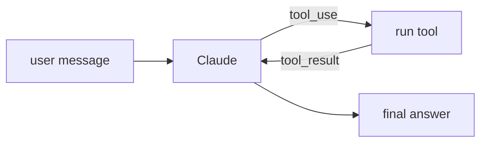

## Overview

Claude is Anthropic's family of frontier models.  
For agentic workloads it is a strong default thanks to reliable **tool use** (function calling), large context windows, and steerable instruction-following.

Common model ids (use the latest/most capable for new agents):

- `claude-opus-4-8` — most capable, best for hard reasoning and long agent loops
- `claude-sonnet-4-6` — balanced cost/latency for high-volume agents
- `claude-haiku-4-5-20251001` — fastest/cheapest for simple sub-tasks

The **Code samples** tab shows TypeScript and Python examples — pick from the
selector to compare.

## When to use it

Reach for Claude when your agent needs dependable multi-step tool use, careful
instruction-following, or long-context document reasoning.
