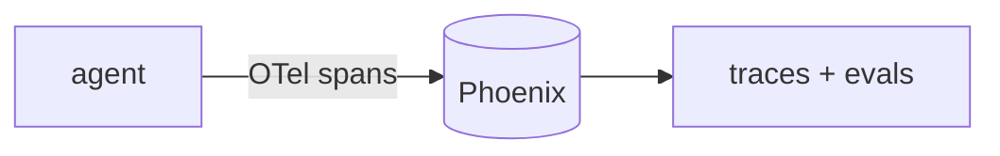

## Overview

Phoenix is Arize's open-source observability tool for LLM and agent apps, built on **OpenTelemetry**.  
It traces each run as nested spans (model calls, tool calls, retrievals), and adds datasets and evaluations on top — all self-hostable with no account.

The **Code samples** tab shows instrumenting an app and running a local Phoenix
server — pick from the selector to compare.

## When to use it

Choose Phoenix when you want open, OpenTelemetry-native tracing and evals you can
run locally or self-host — a close peer to Langfuse on the open-source side.
