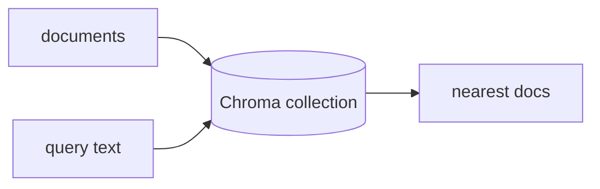

## Overview

Chroma is an open-source embedding database: add documents and it stores their vectors, then answers similarity queries — the retrieval layer for RAG and agent memory.  
It runs in-process (in-memory or on disk) with no separate server to operate, and offers a managed cloud when you need to scale.

The **Code samples** tab shows the built-in embedder and a bring-your-own
embedding function — pick from the selector to compare.

## When to use it

Choose Chroma when you want a lightweight, embedded vector store you can start
with in one line — and bring your own embedding model when you outgrow the
default.
