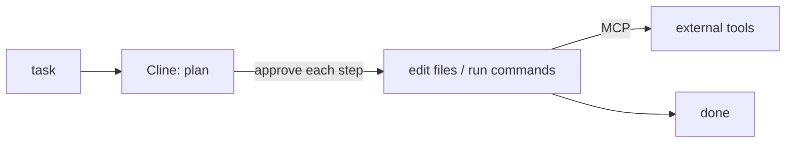

## Overview

Cline (formerly Claude Dev) is a VS Code extension that turns the editor into an agentic workspace.  
It proposes a plan, then — with your approval at each step — creates and edits files, runs terminal commands, and can use external tools via the Model Context Protocol (MCP).  
You bring your own API key.

The **Code samples** tab shows installing it and configuring an MCP server —
pick from the selector to compare.

## When to use it

Pick Cline when you want an autonomous agent **inside your editor** with
human-in-the-loop approvals and MCP tool access, rather than a separate app or
CI-style runner.
