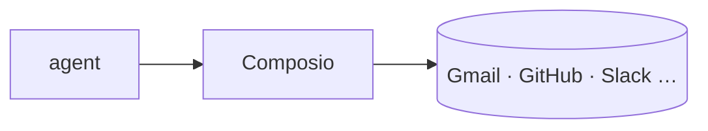

## Overview

Composio is an integration layer that gives agents real tool access to 1000+ external apps.  
It ships ready-made tool definitions and handles the managed auth, so the model can read Gmail, open GitHub issues, or post to Slack without bespoke glue code.

The **Code samples** tab shows fetching tools for a toolkit and letting an LLM call them.

## When to use it

Choose Composio when an agent must take actions in third-party services and you
want managed OAuth plus tool schemas instead of building each connector yourself.
It plugs into frameworks like LangGraph and CrewAI through provider adapters.
