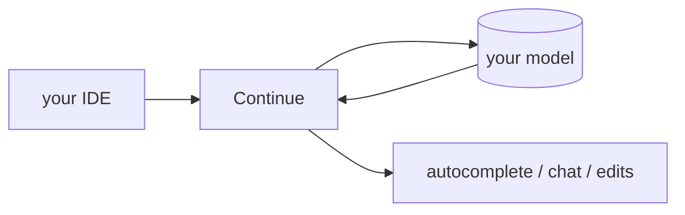

## Overview

Continue is an open-source AI coding assistant that lives in VS Code and JetBrains, offering inline autocomplete, chat, and agentic edits.  
It is model-agnostic and configured with a simple file, so you choose the provider and keep your keys and context local.

## When to use it

Choose Continue when you want a customizable, open-source assistant embedded in
your editor — a self-hosted alternative to closed autocomplete tools, with your
own model and rules.
