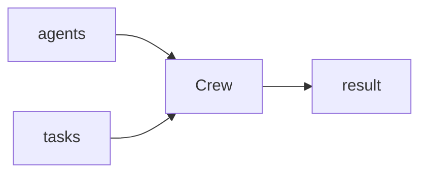

## Overview

CrewAI assembles a **crew** of role-specialized agents that collaborate on tasks toward a goal.  
Each agent has a role, goal, and backstory; you hand the crew a list of tasks and `kickoff` runs them — sequentially or in parallel.

The **Code samples** tab shows a single agent and a multi-agent sequence — pick
from the selector to compare.

## When to use it

Choose CrewAI when the work splits naturally across roles (researcher, writer,
reviewer) and you want a high-level way to wire their collaboration.
