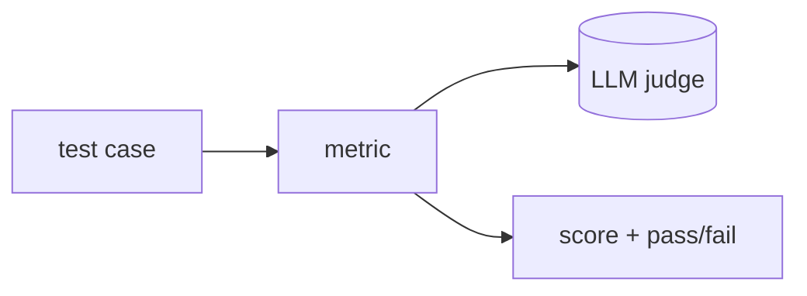

## Overview

DeepEval is an open-source evaluation framework that treats LLM testing like unit testing — "Pytest for LLMs" — with a library of metrics for relevancy, faithfulness, hallucination, bias, and custom criteria.  
It runs locally and in CI, and pairs with the Confident AI platform for hosted dashboards and regression tracking.

The **Code samples** tab shows scoring a single test case.

## When to use it

Choose DeepEval when you want evaluation wired into your test workflow — writing
metric-based assertions for model and RAG output, and gating CI on them, with an
optional hosted platform on top.
