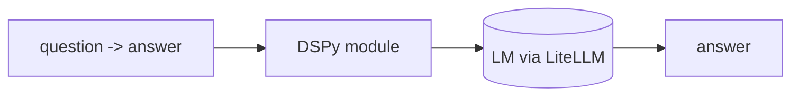

## Overview

DSPy (from Stanford NLP) lets you write LM pipelines as **declarative Python modules** with typed signatures (`question -> answer`) instead of hand-tuned prompt strings.  
Optimizers ("teleprompters") then compile those modules — searching prompts and few-shot examples against a metric — so quality improves without manual prompt fiddling.

The **Code samples** tab shows declaring a module and compiling it with an
optimizer — pick from the selector to compare.

## When to use it

Choose DSPy when you'd rather optimize a pipeline against a metric than maintain
brittle prompt strings — especially for multi-stage reasoning or RAG systems.
