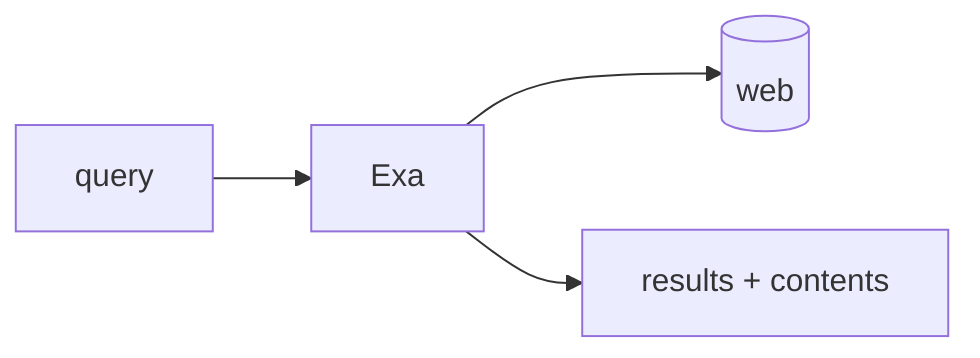

## Overview

Exa is a neural web search API built for agents and retrieval pipelines.  
It ranks pages by embedding similarity rather than keyword overlap, and can return the full page text or highlights in the same request, so an agent gets searchable, ready-to-read context in one round trip.

The **Code samples** tab shows running a semantic search and pulling page contents in one call.

## When to use it

Choose Exa when an agent needs to discover relevant pages by meaning and feed their contents straight into a prompt or RAG step. It fits research, grounding, and freshness checks where keyword search misses the intent.
