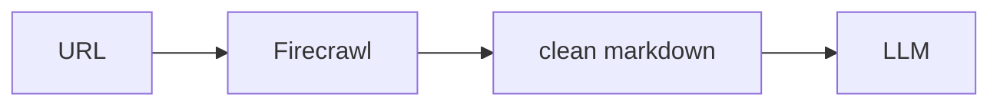

## Overview

Firecrawl turns any URL or whole site into clean, LLM-ready markdown or structured data.  
It handles fetching, rendering, and boilerplate removal, so an agent gets readable text instead of raw HTML.

The **Code samples** tab shows scraping a single page into markdown.

## When to use it

Choose Firecrawl when you need web content as clean markdown for retrieval or
prompting, and you would rather not write and maintain scraping and parsing code
yourself.
