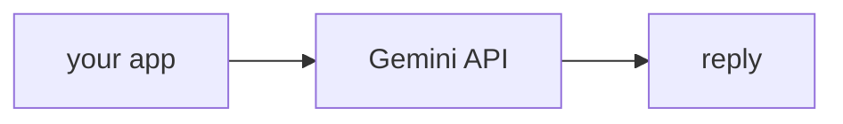

## Overview

Gemini is Google's family of frontier models, reachable through the **AI Studio** API with a free tier that makes it an easy default for demos.  
It offers very large context windows and native multimodal inputs (text, images, audio, video).

Common model ids:

- `gemini-2.5-flash` — fast and cheap, generous free tier
- `gemini-2.5-pro` — most capable, for harder reasoning

The **Code samples** tab shows the native SDK and the LiteLLM route — pick from
the selector to compare.

## When to use it

Reach for Gemini when you want a free tier to prototype with, very long context,
or built-in multimodal input — and route it through LiteLLM to stay portable.
