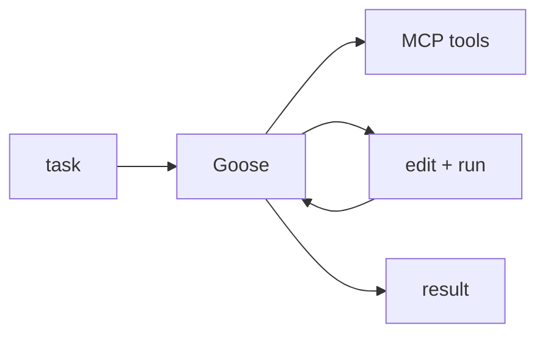

## Overview

Goose is an open-source coding agent from Block that runs locally and executes real tasks — editing files, running commands, and calling tools through the Model Context Protocol.  
It is model-agnostic (bring your own LLM key) and ships as both a CLI and a desktop app.

## When to use it

Choose Goose when you want a self-hosted, extensible agent that automates
developer tasks with your own model and MCP-based tools, without a hosted
service in the loop.
