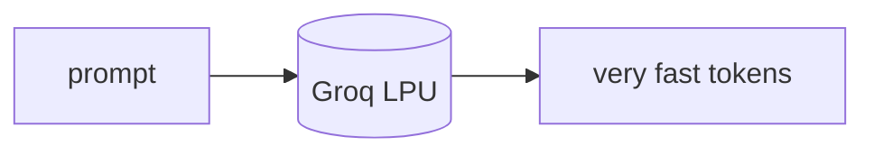

## Overview

Groq is an inference provider that runs open-source models on its custom LPU hardware, delivering some of the fastest tokens-per-second available.  
It exposes an OpenAI-compatible API with a generous free developer tier, so it drops into existing code through LiteLLM or the OpenAI SDK.

The **Code samples** tab shows a LiteLLM-routed call.

## When to use it

Choose Groq when speed is the priority and an open model (Llama, Qwen, and
others) fits the task — especially real-time agents, where its throughput
shortens each reasoning step.
