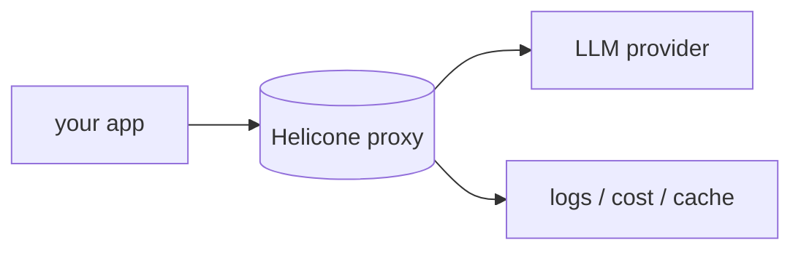

## Overview

Helicone is an open-source observability platform for LLM apps that works as a proxy: route your provider calls through its gateway and get logging, caching, rate limiting, and cost tracking with a one-line change.  
It runs as managed Helicone Cloud or self-hosted, and also offers an async SDK when you would rather not proxy.

The **Code samples** tab shows the proxy approach with the OpenAI SDK.

## When to use it

Choose Helicone when you want the fastest path to logging and cost visibility —
a gateway you drop in front of any OpenAI-compatible provider — with self-hosting
available for data control.
