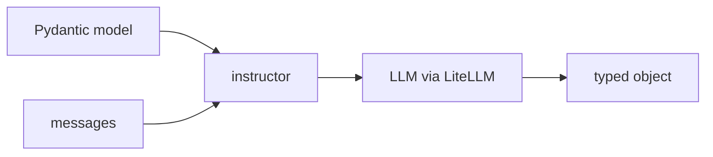

## Overview

instructor turns an LLM into a typed function: you describe the output with a **Pydantic model** and get a validated Python object back instead of free-form text.  
It wraps the call — routing through LiteLLM — and reprompts until the response fits your schema, so downstream code can rely on the types.

The **Code samples** tab shows a basic extraction and a validated-with-retry
example — pick from the selector to compare.

## When to use it

Reach for instructor whenever an LLM's output feeds code that expects structure
— extraction, classification, routing — and you want validation and retries
instead of brittle JSON parsing.
