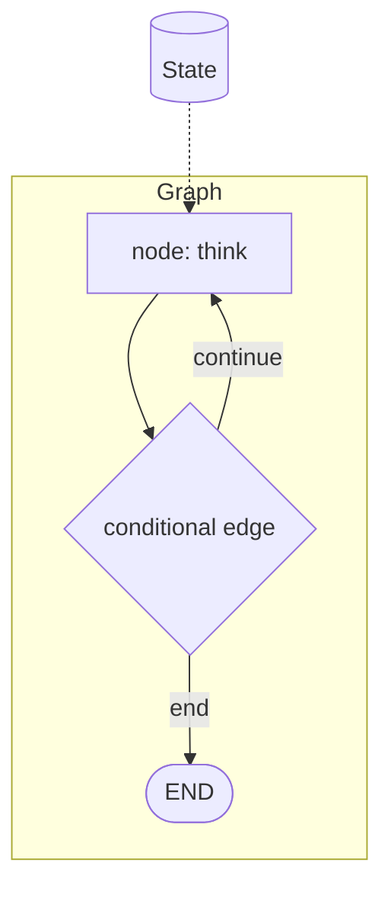

## Overview

LangGraph models an agent as a **graph of nodes** connected by edges.  
Each node is a step (call the model, run a tool, update memory); edges decide what runs next.  
Because state is explicit, you get durable execution, loops, branching, and human-in-the-loop pauses that are hard to express with a plain while-loop.

The **Code samples** tab shows the same idea written two ways — pick the API
version from the selector to compare.

## When to use it

Pick LangGraph when an agent needs cycles, retries, or checkpointed state across
many steps — anything more structured than a single linear prompt chain.
