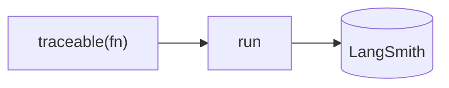

## Overview

LangSmith is LangChain's hosted platform for the operational side of LLM apps: trace every model and tool call, run evaluations against datasets, manage and version prompts, and monitor cost and latency in production.  
It integrates tightly with LangChain/LangGraph but works with any stack via its SDK.

The **Code samples** tab shows TypeScript and Python examples — pick from the
selector to compare.

## When to use it

Choose LangSmith when you want a managed, batteries-included observability and
eval platform — especially if you're already in the LangChain ecosystem.

See also: [Langfuse vs LangSmith](../../blog/langfuse-vs-langsmith/).
