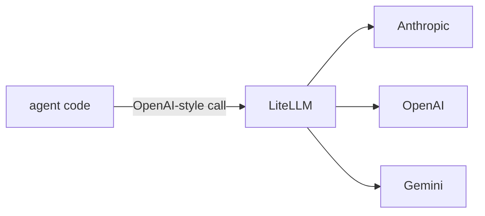

## Overview

LiteLLM is a thin abstraction over many model providers (Anthropic, OpenAI, Bedrock, Vertex, local models, …) exposing a single OpenAI-compatible call.  
Beyond the SDK, its **proxy server** acts as an LLM gateway: load balancing, automatic fallbacks, retries, budgets, and per-key cost tracking — so agents can swap models without code changes.

The **Code samples** tab shows two ways to use LiteLLM — pick the SDK call or
the Router fallback from the selector to compare.

## When to use it

Use LiteLLM when an agent must stay provider-agnostic, needs fallbacks across
models, or when you want a central gateway to enforce budgets and track spend.
