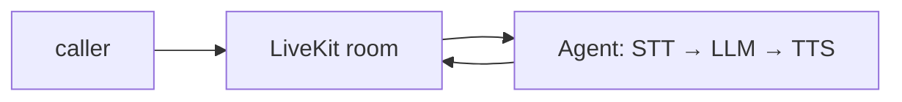

## Overview

LiveKit Agents is a realtime framework for building voice, video, and physical AI agents on the LiveKit WebRTC stack.  
An `AgentSession` strings speech-to-text, an LLM, and text-to-speech into a low-latency pipeline, with built-in turn detection so callers can interrupt and converse naturally.

The **Code samples** tab shows a minimal voice agent entrypoint wiring STT, an LLM, and TTS.

## When to use it

Choose LiveKit Agents when you want a real-time conversational voice or video agent over WebRTC, rather than turn-based text chat. Self-host the open-source framework, or run it on LiveKit Cloud for managed, global edge infrastructure.
