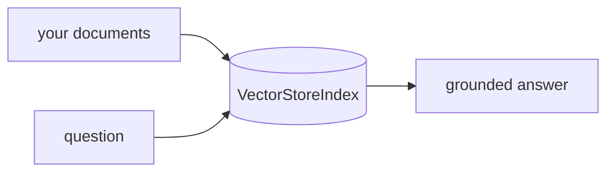

## Overview

LlamaIndex is a data framework for connecting LLMs to your own data — it ingests, chunks, embeds, and indexes documents, then retrieves the relevant pieces at query time.  
It is one of the most common ways to build RAG pipelines and document agents, with connectors for dozens of vector stores and data sources.

The **Code samples** tab shows a minimal index-and-query flow.

## When to use it

Choose LlamaIndex when retrieval is the core of your app — RAG over documents,
knowledge bases, or structured sources — and you want ingestion and querying
handled by a mature framework. LlamaCloud adds hosted parsing and indexing.
