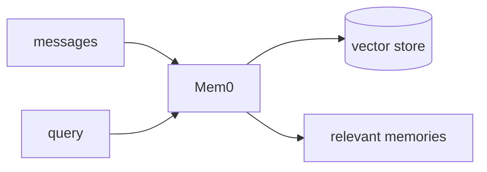

## Overview

Mem0 is a memory layer that gives agents long-term, per-user recall.  
Instead of storing raw conversation chunks, it runs an extraction step that distils messages into compact facts, then retrieves the relevant ones when you search — a different shape of problem than plain vector retrieval.

The **Code samples** tab shows storing and searching memories, then folding them
into a prompt — pick from the selector to compare.

## When to use it

Choose Mem0 when an agent should remember user preferences and facts across
sessions, rather than re-reading the whole history every turn.
