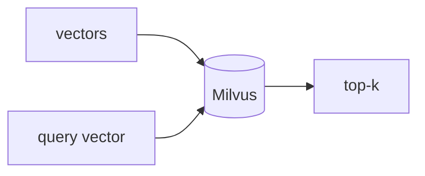

## Overview

Milvus is an open-source vector database designed for similarity search at massive scale, with a distributed architecture that handles billions of vectors.  
It runs embedded (Milvus Lite), self-hosted, or as managed Zilliz Cloud — the same API across all three.

The **Code samples** tab shows the embedded Milvus Lite flow.

## When to use it

Choose Milvus when you expect very large collections and need a battle-tested
distributed vector store — prototype with Milvus Lite, then scale to a cluster
or Zilliz Cloud without changing your code.
