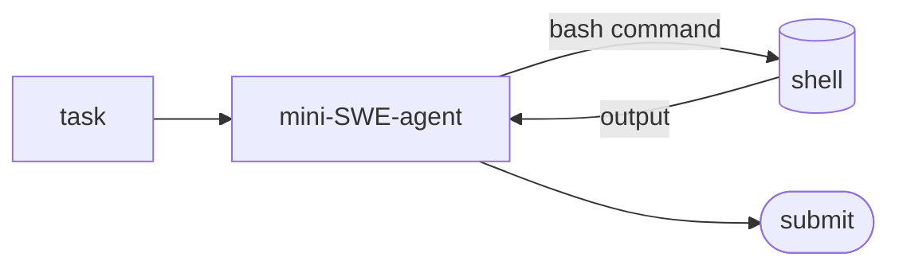

## Overview

mini-SWE-agent is the streamlined successor to [SWE-agent](../swe-agent/).  
It keeps the same idea — let a model read, edit, and run code to fix a GitHub issue — but strips the agent loop down to roughly **100 lines**: no special tools, just shell commands.  
It's simpler to read, hack on, and deploy while staying competitive on SWE-bench.

The **Code samples** tab shows two ways to use it — the CLI and the Python
binding; pick from the selector to compare.

## When to use it

Prefer mini-SWE-agent over SWE-agent for new work: it's the actively developed
path, and its tiny core makes it easy to understand and customize.
