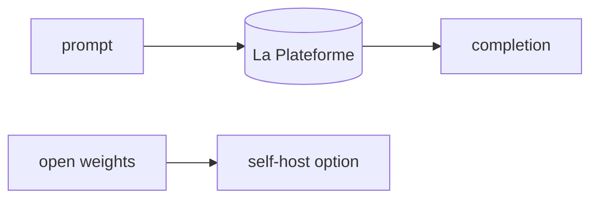

## Overview

Mistral AI is a European foundation-model lab known for releasing strong open-weight models (Mistral, Mixtral, Codestral) alongside its hosted API, La Plateforme.  
The API is OpenAI-shaped and has a free experimentation tier, while the open-weight models can be downloaded and self-hosted.

The **Code samples** tab shows a LiteLLM-routed call.

## When to use it

Choose Mistral when you want a cost-effective frontier alternative with EU data
residency, or when the flexibility to self-host the same family of open-weight
models matters.
