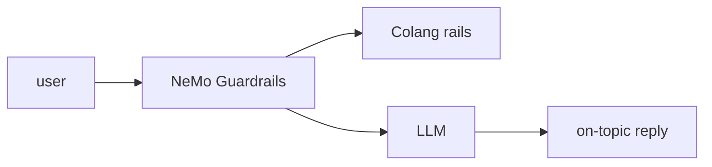

## Overview

NeMo Guardrails is an open-source toolkit for adding programmable guardrails to LLM-based conversational apps.  
You define rails in Colang — input, dialog, retrieval, and output checks — and the library enforces them around every model call so replies stay safe and on-topic.

The **Code samples** tab shows loading a config and generating a guarded reply.

## When to use it

Choose NeMo Guardrails when you need programmable, testable controls over an LLM
conversation — blocking off-topic or unsafe turns and steering dialog flows —
rather than relying on prompt instructions alone.
