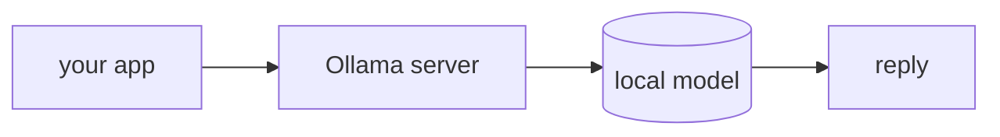

## Overview

Ollama runs open-weight models (Llama, Qwen, Gemma, …) on your own machine with a single command, exposing an **OpenAI-compatible API** on `localhost:11434`.  
It is the local, no-key option for agents: free, private, and offline — and it drops into a LiteLLM-routed app by changing only the model string.

The **Code samples** tab shows the CLI and the LiteLLM route — pick from the
selector to compare.

## When to use it

Reach for Ollama when you want to develop offline, keep data on-device, or avoid
API costs — and use the `ollama_chat/` prefix through LiteLLM when the agent
needs tool calling.
