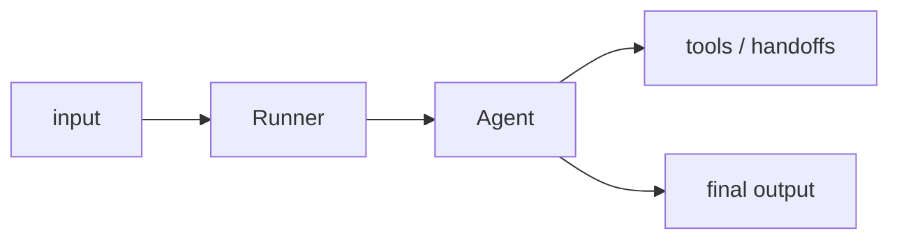

## Overview

The OpenAI Agents SDK is a lightweight, provider-first framework for building agents from a few primitives: agents, tools, handoffs between agents, and guardrails.  
It is the production-oriented successor to OpenAI's Swarm experiment, with built-in tracing and a small surface area.

The **Code samples** tab shows a minimal single-agent run.

## When to use it

Choose it when you want a thin, composable agent loop close to the OpenAI API —
especially for tool use, multi-agent handoffs, and guardrails — without adopting
a larger orchestration framework.
