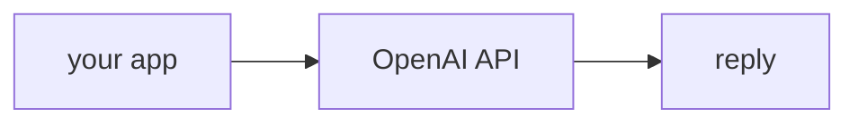

## Overview

OpenAI's API serves the GPT models and popularized the **chat completions** shape that most of the ecosystem now mirrors.  
It has first-class function calling and structured outputs, and the broadest tooling/integration support of any provider.

Common model ids:

- `gpt-4o` — flagship multimodal model
- `gpt-4o-mini` — fast and cheap for high-volume work

The **Code samples** tab shows the native SDK and the LiteLLM route — pick from
the selector to compare.

## When to use it

Reach for OpenAI when you want broad ecosystem support and mature function
calling — and route it through LiteLLM so you can swap providers later.
