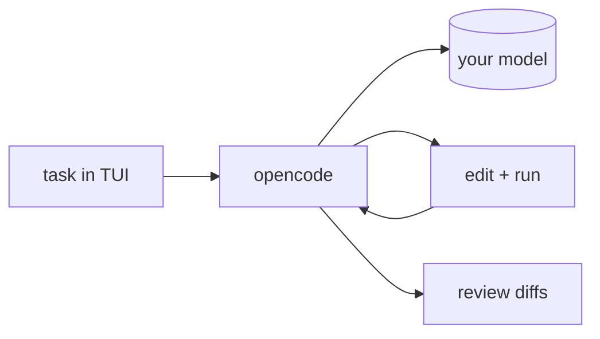

## Overview

opencode is an open-source coding agent for the terminal from the SST team, built around a fast TUI and a client/server design.  
It is model-agnostic — use any provider — and works alongside whatever editor you already have.

## When to use it

Choose opencode when you want a terminal-first coding agent with a strong TUI
and no editor lock-in, driving your own model from the command line.
