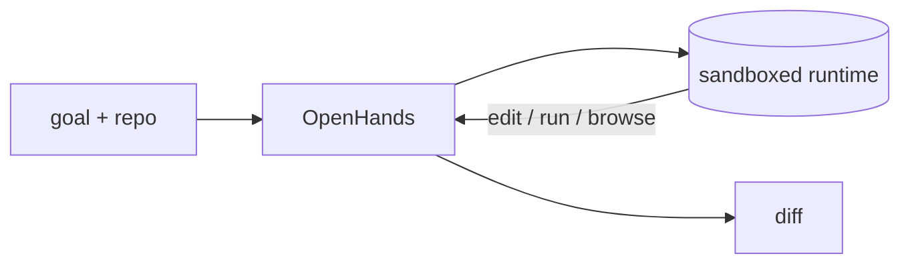

## Overview

OpenHands (formerly OpenDevin) runs an AI agent that works like a developer: it writes and edits code, executes shell commands in a sandboxed runtime, browses the web, and iterates until a task is done.  
You give it a goal and a repo; it does the multi-step work and shows you the diff.

The **Code samples** tab shows the Docker GUI and the headless CLI — pick from
the selector to compare.

## When to use it

Choose OpenHands when you want a full autonomous coding loop with a real
sandboxed environment (not just file edits) and a UI to supervise the agent.
