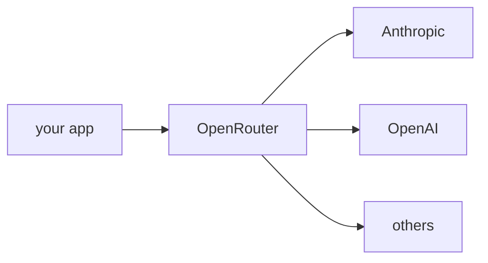

## Overview

OpenRouter is a gateway that exposes 300+ models from many providers behind one **OpenAI-compatible** API and key.  
It adds routing, automatic fallbacks, and unified billing, so an agent can reach Claude, GPT, Gemini, Llama, and more without juggling separate accounts.

The **Code samples** tab shows the LiteLLM route and the OpenAI SDK route — pick
from the selector to compare.

## When to use it

Reach for OpenRouter when you want a single key and endpoint across many
providers — to compare models, add fallbacks, or avoid managing each account.
