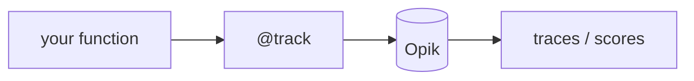

## Overview

Opik is an open-source LLM observability platform from Comet that combines tracing, evaluation, and monitoring — capture every call as a trace, attach scores, and watch dashboards in production.  
It runs self-hosted or as managed Comet Cloud, and integrates with popular frameworks and the `@track` decorator.

The **Code samples** tab shows tracing a function with `@track`.

## When to use it

Choose Opik when you want tracing and evaluation together in one self-hostable
platform — instrumenting an app for production monitoring while scoring quality,
without stitching separate tools.
