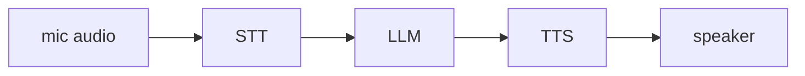

## Overview

Pipecat is an open-source Python framework for building real-time voice and multimodal conversational agents.  
You wire a transport, speech-to-text, an LLM, and text-to-speech into a `Pipeline`, and Pipecat streams audio through it as frames so the full round-trip stays low-latency.

The **Code samples** tab shows wiring an STT, LLM, and TTS service into a Pipecat pipeline.

## When to use it

Choose Pipecat when you need a vendor-neutral, self-hostable voice agent that streams audio in real time and lets you swap STT, LLM, and TTS providers freely.
