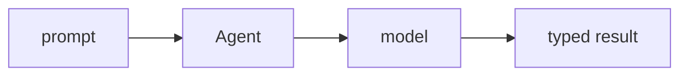

## Overview

Pydantic AI is an agent framework from the team behind Pydantic, built around **typed, validated** results.  
You give an `Agent` a model and (optionally) an `output_type`, and it returns plain Python objects you can trust — across OpenAI, Anthropic, Gemini, and more.

The **Code samples** tab shows a plain agent and a structured-output agent —
pick from the selector to compare.

## When to use it

Choose Pydantic AI when you want an agent that fits a Python codebase — typed
results, dependency injection, and validation — rather than a heavier framework.
