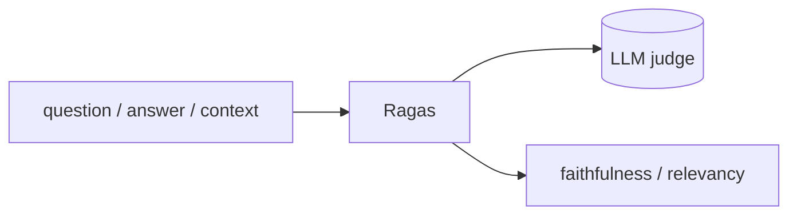

## Overview

Ragas is an open-source framework for evaluating RAG pipelines and LLM applications, with reference-free metrics like faithfulness, answer relevancy, and context precision.  
It turns "does this RAG system actually work?" into numbers you can track in CI and compare across changes.

The **Code samples** tab shows a minimal RAG evaluation.

## When to use it

Choose Ragas when retrieval quality matters and you want objective, repeatable
metrics for your RAG pipeline — to catch regressions and compare retrievers,
chunking, or prompts.
