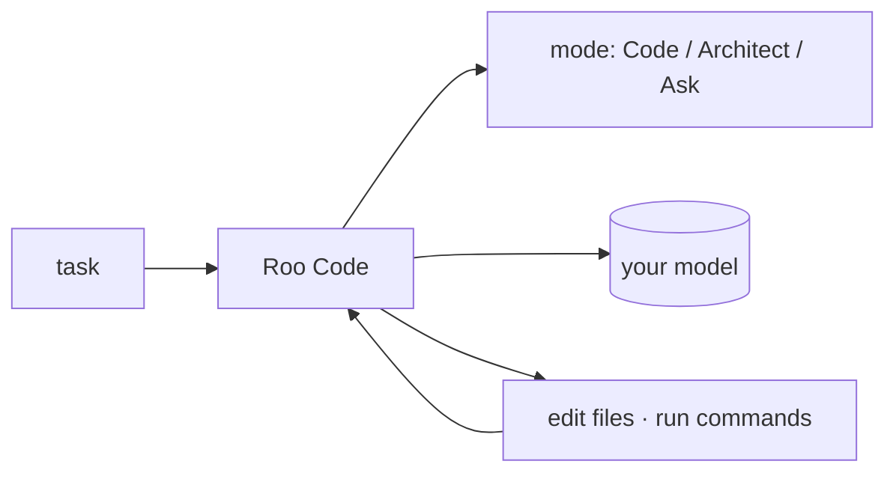

## Overview

Roo Code is an open-source, agentic coding extension for VS Code (a community fork of Cline) that reads your project, edits files, and runs commands.  
It adds switchable **modes** (Code, Architect, Ask, and custom) and MCP tool support, and is model-agnostic.

## When to use it

Choose Roo Code when you want a free, in-editor autonomous agent with fine
control over behavior via modes and MCP — a self-hosted alternative to hosted
IDE agents.
