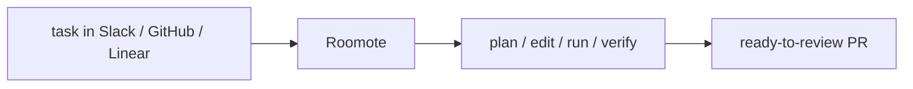

## Overview

Roomote is a cloud-based autonomous coding agent from the team behind Roo Code. You hand it a task — in Slack, GitHub, or Linear — and it plans, edits, runs, and verifies the change end to end, returning a ready-to-review pull request.  
It is the successor to the Roo Code VS Code extension, which the team sunset in 2026 to focus on cloud agents that work outside the editor.

## When to use it

Choose Roomote when you want an autonomous agent that picks up a task from the
tools you already use and returns finished, verified work — rather than an
in-editor assistant. It runs in the cloud on paid per-instance plans.
