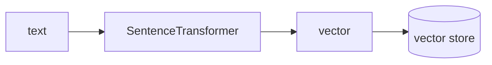

## Overview

Sentence Transformers (SBERT) runs embedding models — like the multilingual `bge-m3` — directly on your machine, turning text into vectors with no API call.  
It is the local, provider-independent half of a RAG pipeline: generate embeddings here, then store and search them in a vector store.

The **Code samples** tab shows encoding text and a built-in similarity search —
pick from the selector to compare.

## When to use it

Choose Sentence Transformers when you want embeddings computed locally — for
cost, privacy, or offline use — instead of calling a hosted embedding API.
