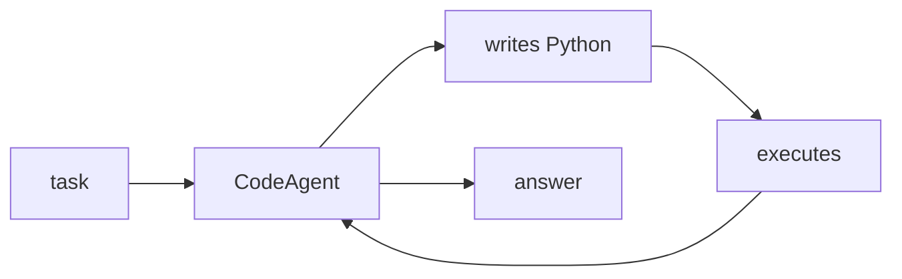

## Overview

smolagents is a deliberately tiny library from Hugging Face — the agent logic fits in roughly a thousand lines — built around **code agents** that take actions by writing and running Python.  
It is model-agnostic: local transformers, Hugging Face Hub models, or any provider through LiteLLM.

The **Code samples** tab shows a code agent backed by LiteLLM.

## When to use it

Reach for smolagents when you want a minimal, hackable agent loop, or when
code-writing actions suit the task (math, data wrangling, multi-step tool use)
better than JSON function calls.
