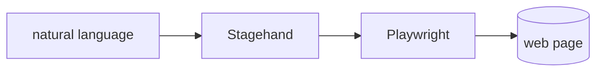

## Overview

Stagehand is an AI browser-automation framework from Browserbase that layers `act`, `extract`, and `observe` on top of Playwright.  
You write steps in natural language, and Stagehand resolves them to real browser actions that self-heal when a page changes.

The **Code samples** tab shows acting on a page and extracting typed data with a zod schema.

## When to use it

Choose Stagehand when brittle CSS or XPath selectors keep breaking your scrapers
and agents, and you want natural-language steps that adapt. Run it locally for
free, or on the Browserbase cloud for managed, scalable browsers.
