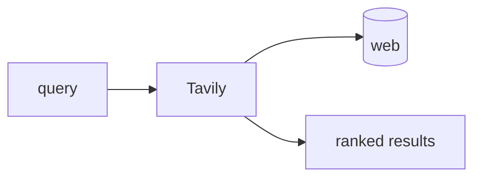

## Overview

Tavily is a web search API built for LLMs and agents that returns clean, ranked, RAG-ready results from a single call.  
Instead of parsing raw HTML, you get scored snippets and source URLs you can feed straight into a model.

The **Code samples** tab shows a basic search returning ranked results.

## When to use it

Choose Tavily when an agent needs live web knowledge with minimal plumbing.
It handles fetching, ranking, and cleaning, so you spend credits instead of
maintaining scrapers and parsers.
