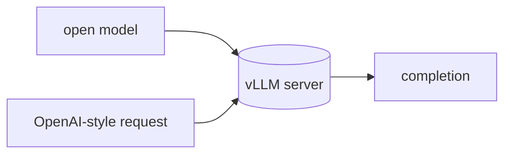

## Overview

vLLM is a high-throughput, memory-efficient inference and serving engine for LLMs, best known for PagedAttention and continuous batching.  
It serves open models behind an OpenAI-compatible API, so anything that speaks OpenAI — including LiteLLM — can call your self-hosted endpoint.

The **Code samples** tab shows serving a model and calling it over HTTP.

## When to use it

Choose vLLM when you run open models on your own GPUs and need maximum
throughput and concurrency — production self-hosted inference rather than a
desktop or single-stream local runtime.
