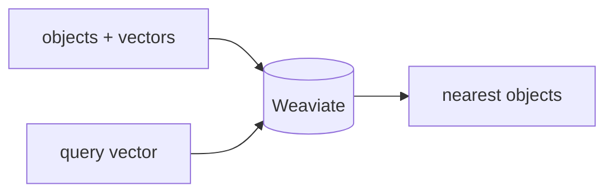

## Overview

Weaviate is an open-source vector database with hybrid (vector + keyword) search, structured filtering, and optional vectorizer modules that embed your data for you.  
It runs self-hosted with Docker or as managed Weaviate Cloud, and is a common retrieval layer for RAG and agents.

The **Code samples** tab shows a bring-your-own-vectors flow.

## When to use it

Choose Weaviate when you want hybrid search and rich filtering in one engine,
with the option of built-in vectorizers — self-hosted or on Weaviate Cloud.
